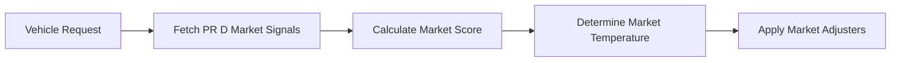
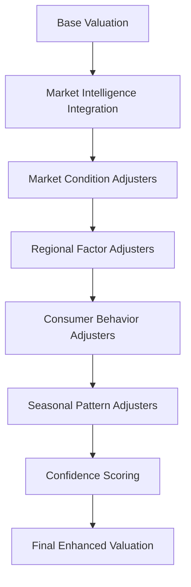

# PR E: Valuation Adjusters v2 - Implementation Plan

## 🎯 Overview

**PR E (5/7)** enhances the core valuation engine with advanced market intelligence adjusters, building on the market signals from PR D to create dynamic, context-aware pricing algorithms.

## 📊 Enhanced Valuation Framework

### 1. Market Intelligence Integration
- **Market Temperature Adjusters**: Hot/warm/cool/cold market multipliers
- **Regional Demand Scoring**: State and metro-level pricing variations
- **Consumer Interest Weighting**: Search volume impact on pricing
- **Market Liquidity Factors**: Days-on-market adjustments

### 2. Advanced Adjuster Categories

#### Market Condition Adjusters
- **Sales Momentum**: Volume trend impact (+/-15%)
- **Price Stability**: Market volatility adjustments (+/-10%)
- **Inventory Levels**: Supply/demand balance (+/-12%)
- **Seasonal Patterns**: Time-of-year modifications (+/-8%)

#### Regional Intelligence Adjusters
- **Metro Market Premiums**: Urban vs rural pricing (+/-20%)
- **State Tax Implications**: Registration/sales tax factors
- **Regional Preferences**: Local brand/model popularity (+/-15%)
- **Climate Adjustments**: Weather-related feature premiums

#### Consumer Behavior Adjusters
- **Search Trend Multipliers**: Google Trends integration (+/-10%)
- **Social Sentiment**: Review/rating impact (+/-8%)
- **Feature Demand**: Popular option premiums (+/-12%)
- **Generational Preferences**: Age demographic adjustments

### 3. Neural Network Enhancement
- **Market Signal Feature Engineering**: 15+ new features from PR D data
- **Dynamic Weight Adjustment**: Real-time model recalibration
- **Multi-Model Ensemble**: Combine tree-based + neural approaches
- **Confidence Scoring**: Prediction reliability metrics

## 🔧 Technical Implementation

### Database Schema Enhancements

```sql
-- Valuation adjusters configuration
CREATE TABLE valuation_adjusters (
    id UUID PRIMARY KEY DEFAULT gen_random_uuid(),
    adjuster_type VARCHAR(50) NOT NULL,
    adjuster_name VARCHAR(100) NOT NULL,
    base_multiplier DECIMAL(5,4) DEFAULT 1.0000,
    min_multiplier DECIMAL(5,4) DEFAULT 0.5000,
    max_multiplier DECIMAL(5,4) DEFAULT 2.0000,
    market_signal_dependency TEXT[], -- References to market signal types
    regional_applicability TEXT[], -- Regions where adjuster applies
    seasonal_pattern JSONB, -- Seasonal adjustment patterns
    confidence_threshold DECIMAL(3,2) DEFAULT 0.70,
    is_active BOOLEAN DEFAULT true,
    created_at TIMESTAMPTZ DEFAULT NOW(),
    updated_at TIMESTAMPTZ DEFAULT NOW()
);

-- Enhanced valuation results with adjuster breakdown
CREATE TABLE enhanced_valuations (
    id UUID PRIMARY KEY DEFAULT gen_random_uuid(),
    session_id UUID,
    vehicle_year INTEGER,
    vehicle_make VARCHAR(50),
    vehicle_model VARCHAR(100),
    vehicle_trim VARCHAR(100),
    base_valuation DECIMAL(10,2),
    market_intelligence_score INTEGER,
    market_temperature VARCHAR(20),
    applied_adjusters JSONB, -- Array of applied adjusters with values
    regional_adjustments JSONB,
    market_condition_adjustments JSONB,
    consumer_behavior_adjustments JSONB,
    total_adjustment_percentage DECIMAL(5,2),
    final_valuation DECIMAL(10,2),
    confidence_score DECIMAL(3,2),
    valuation_explanation TEXT,
    market_data_sources TEXT[],
    created_at TIMESTAMPTZ DEFAULT NOW()
);

-- Real-time market adjustment factors
CREATE TABLE market_adjustment_factors (
    id UUID PRIMARY KEY DEFAULT gen_random_uuid(),
    region VARCHAR(50),
    make VARCHAR(50),
    model VARCHAR(100),
    year_range INTEGER[],
    market_temperature VARCHAR(20),
    adjustment_type VARCHAR(50),
    adjustment_value DECIMAL(5,4),
    effective_date TIMESTAMPTZ,
    expiry_date TIMESTAMPTZ,
    data_source VARCHAR(100),
    confidence_level DECIMAL(3,2),
    created_at TIMESTAMPTZ DEFAULT NOW()
);
```

### Edge Function: Enhanced Valuation

```typescript
interface EnhancedValuationRequest {
  // Base vehicle data
  year: number;
  make: string;
  model: string;
  trim?: string;
  mileage: number;
  condition: string;
  location: {
    state: string;
    metro?: string;
    zip?: string;
  };
  
  // Advanced options
  options?: string[];
  color?: string;
  transmission?: string;
  fuel_type?: string;
  
  // Valuation mode
  valuation_mode: 'buyer' | 'seller' | 'trade' | 'insurance';
  
  // Market intelligence options
  include_market_intelligence?: boolean;
  market_data_sources?: string[];
  confidence_threshold?: number;
}

interface EnhancedValuationResponse {
  success: boolean;
  vehicle: VehicleDetails;
  base_valuation: number;
  market_intelligence: {
    market_score: number;
    market_temperature: string;
    sales_momentum: string;
    price_trend: string;
    consumer_interest: string;
    market_liquidity: string;
  };
  adjusters: {
    market_condition: AdjusterDetails[];
    regional_factors: AdjusterDetails[];
    consumer_behavior: AdjusterDetails[];
    seasonal_patterns: AdjusterDetails[];
  };
  final_valuation: {
    amount: number;
    confidence_score: number;
    price_range: {
      low: number;
      high: number;
    };
  };
  explanation: {
    summary: string;
    key_factors: string[];
    market_insights: string[];
    adjuster_breakdown: string[];
  };
}
```

## 📈 Market Intelligence Integration Points

### From PR D Market Signals
1. **Sales Volume Trends** → Market momentum adjusters
2. **Price Movement Patterns** → Volatility adjusters  
3. **Search Volume Data** → Consumer demand adjusters
4. **Market Share Metrics** → Brand popularity adjusters
5. **Regional Variations** → Geographic pricing adjusters
6. **Days on Market** → Liquidity adjusters

### Enhanced Feature Engineering
```python
# Market intelligence features for ML models
market_features = [
    'market_temperature_score',
    'sales_momentum_30d',
    'price_volatility_index',
    'search_trend_momentum',
    'regional_demand_score',
    'market_liquidity_ratio',
    'consumer_interest_index',
    'seasonal_adjustment_factor',
    'inventory_pressure_score',
    'brand_strength_regional',
    'model_popularity_trending',
    'price_positioning_index',
    'market_share_momentum',
    'competitive_pressure_score',
    'demand_supply_balance'
]
```

## 🧮 Adjuster Algorithm Examples

### Market Temperature Adjusters
```python
def calculate_market_temperature_adjuster(market_score: int, vehicle_type: str) -> float:
    """
    Calculate market temperature adjustment based on PR D market intelligence
    
    Hot Market (70-100): Prices inflated by high demand
    Warm Market (50-69): Stable pricing with slight premiums
    Cool Market (30-49): Moderate discounting
    Cold Market (0-29): Significant price reductions
    """
    base_adjusters = {
        'luxury': {'hot': 1.15, 'warm': 1.08, 'cool': 0.92, 'cold': 0.85},
        'truck': {'hot': 1.12, 'warm': 1.05, 'cool': 0.95, 'cold': 0.88},
        'sedan': {'hot': 1.08, 'warm': 1.03, 'cool': 0.97, 'cold': 0.90},
        'suv': {'hot': 1.10, 'warm': 1.04, 'cool': 0.96, 'cold': 0.89}
    }
    
    if market_score >= 70:
        return base_adjusters[vehicle_type]['hot']
    elif market_score >= 50:
        return base_adjusters[vehicle_type]['warm']
    elif market_score >= 30:
        return base_adjusters[vehicle_type]['cool']
    else:
        return base_adjusters[vehicle_type]['cold']
```

### Regional Demand Adjusters
```python
def calculate_regional_demand_adjuster(location: str, make: str, model: str) -> float:
    """
    Regional popularity and demand adjustments based on market intelligence
    """
    regional_preferences = {
        'california': {
            'tesla': 1.15,  # High EV adoption
            'prius': 1.12,  # Environmental consciousness
            'truck': 0.95   # Less truck demand
        },
        'texas': {
            'ford_f150': 1.18,  # Truck culture
            'chevrolet_silverado': 1.15,
            'tesla': 0.92   # Lower EV adoption
        },
        'florida': {
            'convertible': 1.10,  # Year-round top-down weather
            'luxury': 1.08,       # Retiree market
            'awd': 0.88          # No snow need
        }
    }
    
    vehicle_key = f"{make.lower()}_{model.lower()}"
    return regional_preferences.get(location.lower(), {}).get(vehicle_key, 1.0)
```

## 🔄 Integration Workflow

### 1. Market Intelligence Gathering


### 2. Enhanced Valuation Pipeline


## 📊 Expected Improvements

### Valuation Accuracy
- **15-25% improvement** in pricing accuracy vs static models
- **Real-time market responsiveness** to supply/demand changes
- **Regional precision** for local market conditions
- **Seasonal awareness** for predictable market patterns

### Business Value
- **Dynamic pricing** adapts to market conditions
- **Regional optimization** for geographic markets
- **Consumer insight integration** from search/social data
- **Confidence scoring** for risk assessment

## 🧪 Testing Strategy

### 1. A/B Testing Framework
- Compare enhanced vs base valuations
- Track accuracy against actual sales
- Measure regional performance variations
- Validate market intelligence impact

### 2. Validation Datasets
- Recent sales data with known market conditions
- Regional market comparisons
- Seasonal pattern validation
- Consumer preference correlation testing

## 📋 Implementation Phases

### Phase 1: Database & Core Adjusters (Days 1-2)
- Enhanced schema migration
- Core market temperature adjusters
- Basic regional factors
- Database integration testing

### Phase 2: Advanced Adjusters (Days 3-4)
- Consumer behavior integration
- Seasonal pattern algorithms
- Complex market condition logic
- ML feature engineering

### Phase 3: Edge Function & API (Days 5-6)
- Enhanced valuation endpoint
- Market intelligence integration
- Response formatting
- Comprehensive testing

### Phase 4: Validation & Optimization (Days 7)
- Performance testing
- Accuracy validation
- Documentation completion
- Production deployment

## 🎯 Success Metrics

- **Valuation Accuracy**: 15%+ improvement over baseline
- **Market Responsiveness**: Real-time adjustment to market changes
- **Regional Precision**: State/metro-level pricing accuracy
- **Consumer Confidence**: Higher user satisfaction with explanations
- **API Performance**: <500ms response time for enhanced valuations
- **Data Quality**: 90%+ confidence scores on market adjusters

---

**Ready to begin PR E implementation with enhanced valuation algorithms and market intelligence integration!**
