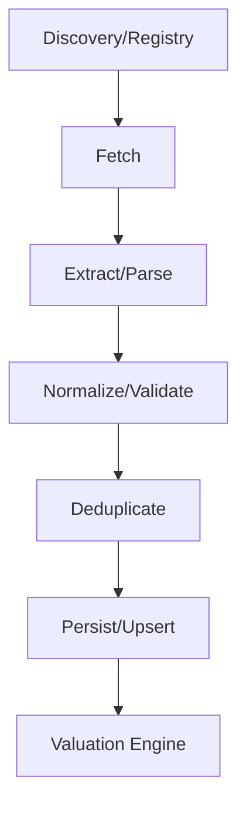

# Listings & Data Fetch Audit Report

**Repo:** ain-valuation-engine
**Audit Date:** 2025-08-19

---

## Executive Summary

<!-- Fill in after code scan -->

## System Diagram

## Per-File Analysis

<!-- For each file: path, LOC, purpose, functions (with line numbers), I/O types, baseline fields handling (line refs), error/retry/defaults, deps -->

---

## OpenAI Usage

<!-- Prompts, models, schemas, token caps, file+line refs -->

---

## Validation & Dedupe

<!-- Schemas, required/optional, unique key logic, file+line refs -->

---

## Observability

<!-- Log fields, metrics, run IDs, cost tracking, file+line refs -->

---

## Security & Compliance

<!-- Secrets, robots/ToS, allow/deny lists, file+line refs -->

---

## Gaps & Recommendations

<!-- 1-week / 4-week prioritized list, file+line refs -->
